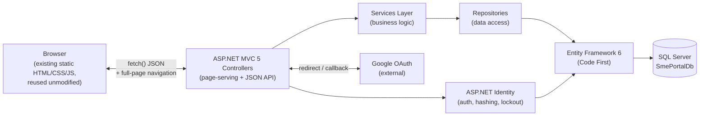
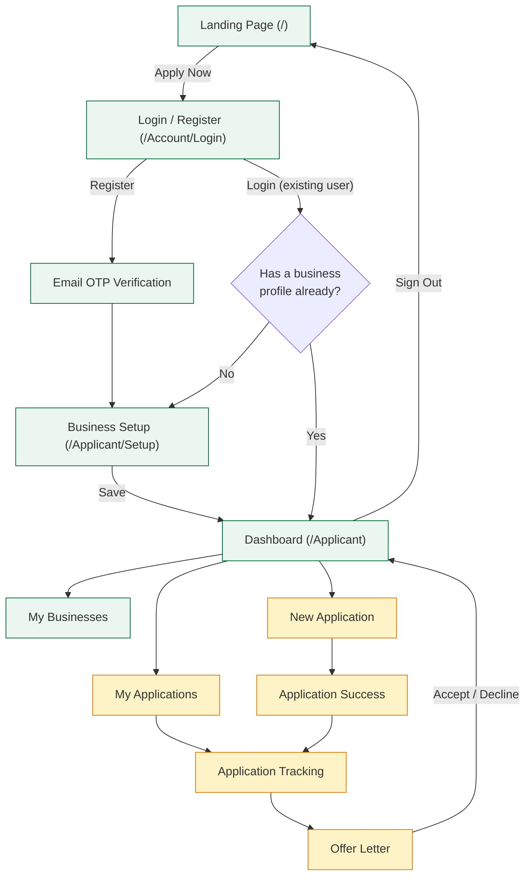
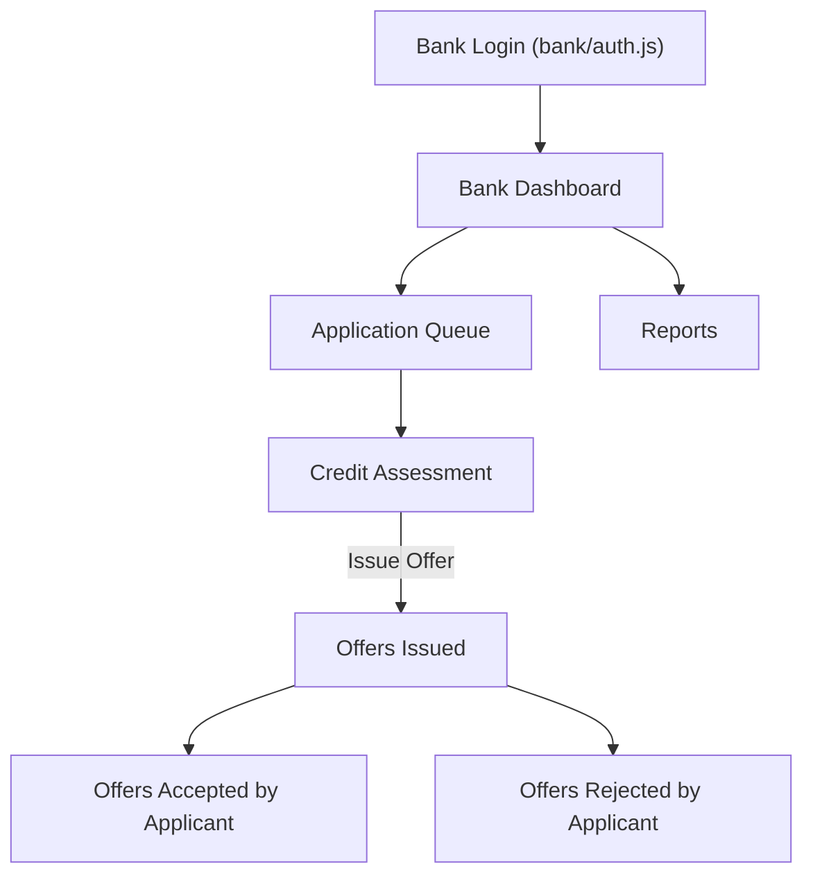
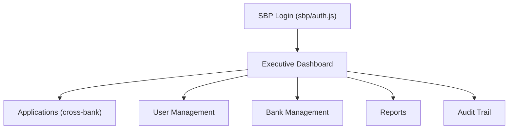
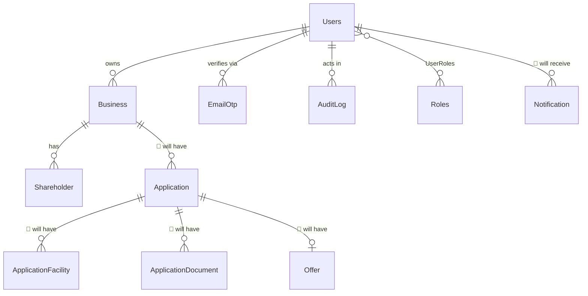

# SME Portal — Backend Implementation Guide

**Audience:** A developer joining this project with no prior context.
**Purpose:** Explain the frontend as it exists, what backend already exists behind it, and exactly how to implement everything that doesn't exist yet — in the same order and the same style as the work already completed.
**Scope of "already built" vs "to be built":** This document is honest about both. Sections marked **✅ Built** describe real, working code you can open right now. Sections marked **🔧 Planned** are a specification for what to build next — no code exists yet for these.

---

## Table of Contents

1. [Project Overview](#1-project-overview)
2. [Complete User Journey](#2-complete-user-journey)
3. [Module Inventory](#3-module-inventory)
4. [Phase-wise Development Plan](#4-phase-wise-development-plan)
5. [Database Design](#5-database-design)
6. [Entity Framework](#6-entity-framework)
7. [Authentication](#7-authentication)
8. [Dashboard Modules](#8-dashboard-modules)
9. [Validation Rules](#9-validation-rules)
10. [Security](#10-security)
11. [API Design](#11-api-design)
12. [Testing Plan](#12-testing-plan)
13. [Folder Structure](#13-folder-structure)
14. [Future Enhancements](#14-future-enhancements)
15. [Development Checklist](#15-development-checklist)
16. [Phase Completion Checklist](#16-phase-completion-checklist)

---

## 1. Project Overview

### 1.1 Purpose of the Portal

The SME Portal is the State Bank of Pakistan's digital platform connecting small and medium enterprises (SMEs) with SBP-regulated banks for concessional financing. Three personas share one codebase:

| Persona | Who they are | Status |
|---|---|---|
| **SME Applicant** | A business owner applying for financing | ✅ Login/Register/Setup/Dashboard shell built; application workflow planned |
| **Participating Bank** | A bank officer assessing applications assigned to their bank | 🔧 Fully planned, not started |
| **SBP Administrator** | SBP staff overseeing the whole platform (users, banks, reports, audit) | 🔧 Fully planned, not started |

### 1.2 User Roles

| Role | Identity Role Name | Seeded Today? |
|---|---|---|
| SME Applicant | `Applicant` | ✅ Yes — seeded in `DAL/Migrations/Configuration.cs` |
| Participating Bank | `Bank` | 🔧 Not yet — planned for Phase 11 |
| SBP Administrator | `Admin` (or `SBP`) | 🔧 Not yet — planned for Phase 12 |

### 1.3 Overall Architecture



**Two layers of integration, on purpose:**

1. **A JSON API layer** (`/api/account/*`, `/api/business/*`) — the single, real implementation of every piece of business logic (register, login, OTP, Google sign-in, save business profile). This is what the existing JavaScript actually calls via `fetch()`.
2. **A thin MVC page layer** (`HomeController`, `AccountController`'s page actions, `ApplicantController`) — each real screen is a `.cshtml` view that loads one small **bootstrap script**, which imports the **existing, unmodified** JavaScript module for that screen and mounts it into the page. The MVC controller never re-implements what the JavaScript already does.

This split exists because the frontend was originally a 100% client-side single-page app (SPA) with its own hash-based router (`Scripts/js/router.js`). Converting it to real ASP.NET MVC routes while keeping every pixel and every interaction identical required treating the JS as a black box to be *mounted*, not rewritten.

### 1.4 Technology Stack

| Layer | Technology |
|---|---|
| Web framework | ASP.NET MVC 5, .NET Framework 4.8 |
| ORM | Entity Framework 6 (Code First, automatic migrations) |
| Database | SQL Server Express (`.\SQLEXPRESS`), database `SmePortalDb` |
| Authentication | ASP.NET Identity 2.2.3 (Core/Owin/EntityFramework packages) |
| External auth | Google OAuth 2.0 (`Microsoft.Owin.Security.Google`) |
| JSON serialization | Newtonsoft.Json (camelCase, to match JS's expectations) |
| Package management | NuGet via `packages.config` |
| Local web server | IIS Express |
| IDE | Visual Studio 2022 |
| Frontend | Plain HTML/CSS/JavaScript (ES modules), Tailwind-generated CSS, Lucide icons, jsPDF — **no framework, no build step required to run it** |

### 1.5 Folder Structure (Summary — full detail in [Section 13](#13-folder-structure))

```
SME-portal-Static/
├── App_Start/          MVC/route/filter configuration
├── Content/             css/ and images/ (was css/ and assets/ before conversion)
├── Controllers/         Page-serving + JSON API controllers
├── DAL/                 ApplicationDbContext + Migrations
├── Filters/              Custom action/exception filters
├── Helpers/              Small stateless utility classes
├── Models/               EF6 entity classes
├── Repositories/          Data access, one per aggregate
├── Scripts/               js/ (all existing frontend JS, unmodified) + vendor/ + bootstrap/ (new, per-page mount scripts)
├── Services/              Business logic, one per aggregate
├── ViewModels/            Request/response DTOs for controllers
├── Views/                 .cshtml files — thin wrappers only, see Section 1.3
├── Global.asax(.cs)       App startup, security headers
├── Startup.cs / Startup.Auth.cs   OWIN pipeline, Identity, Google OAuth
├── Web.config             Connection strings, app settings, binding redirects
└── packages.config        NuGet package list
```

---

## 2. Complete User Journey

### 2.1 SME Applicant — End-to-End (✅ Auth/Setup/Dashboard shell built, 🔧 rest planned)



Green = built and connected to the real database. Amber = UI exists, not yet connected (Phase 7–8, see [Section 4](#4-phase-wise-development-plan)).

### 2.2 First-Login Decision Logic (✅ Built — important, non-obvious rule)

The "does this applicant see Setup or the Dashboard?" decision is **not** read directly from a stored flag. It is computed live as `hasAnyBusiness = COUNT(Business WHERE UserId = @id) > 0` every time it's needed (`AuthService.ComputeIsFirstLoginAsync`). The `Users.IsFirstLogin` column still exists and is still flipped to `false` the moment a business is saved, for its own literal meaning/audit value — but the actual redirect decision is always recomputed. This avoids a dead end: if a user abandoned Setup without saving a business, a stale `false` flag would otherwise strand them on an empty Dashboard forever.

### 2.3 Participating Bank Journey (🔧 Planned — Phase 11)



### 2.4 SBP Administrator Journey (🔧 Planned — Phase 12)



---

## 3. Module Inventory

Every screen in `Scripts/js/pages/**`. **Status** is the single source of truth for what's real vs. mock — trust this table over assumptions.

### 3.1 Core / Shared (✅ Built)

| Module | Landing Page |
|---|---|
| Purpose | Public marketing/entry page; persona selection (SME/Bank/SBP cards); "Apply Now" CTA |
| Frontend files | `Scripts/js/pages/intro.js` |
| Bootstrap script | `Scripts/js/bootstrap/home.js` |
| MVC View | `Views/Home/Index.cshtml` |
| Controller | `HomeController.Index()` (GET `/`) |
| Services / Repos | None — no data |
| Database tables | None |
| API endpoints | None |
| Validation | N/A |
| Dependencies | `Views/Shared/_Layout.cshtml` |
| Completion status | ✅ Complete |

### 3.2 SME Applicant — Authentication & Onboarding (✅ Built)

| Module | Login / Register / Email OTP |
|---|---|
| Purpose | Sign in, create an account, verify email via a 6-digit code |
| Frontend files | `Scripts/js/pages/sme/auth.js` |
| Bootstrap script | `Scripts/js/bootstrap/login.js` (must call `loadCsrfToken()` before rendering — see [7.9](#79-known-pitfalls)) |
| MVC View | `Views/Account/Login.cshtml` |
| Controller | `AccountController` — `Login()` (GET, page), `RegisterApi`, `VerifyOtp`, `LoginApi`, `GoogleLogin`, `GoogleCallback`, `Logout`, `CurrentUser` |
| Services | `IAuthService`, `IOtpService`, `IAuditService` |
| Repositories | `IUserRepository`, `IOtpRepository`, `IAuditLogRepository` |
| Database tables | `Users`, `Roles`, `UserRoles`, `EmailOtp`, `AuditLog` |
| API endpoints | See [Section 11.1](#111-authentication-apis) |
| Validation | Email format, Pakistani mobile format, password policy (8+ chars, upper/lower/digit/special), duplicate email/mobile check |
| Dependencies | ASP.NET Identity, OWIN Google middleware |
| Completion status | ✅ Complete (Google OAuth code-complete; needs real Google Cloud credentials dropped into `Web.config` to go live) |

| Module | Business Setup |
|---|---|
| Purpose | First-login onboarding form — company details, conditional shareholder/partner list, optional bank details |
| Frontend files | `Scripts/js/pages/sme/businessSetup.js` |
| Bootstrap script | `Scripts/js/bootstrap/setup.js` (must call `loadCsrfToken()` first) |
| MVC View | `Views/Applicant/Setup.cshtml` |
| Controller | `ApplicantController.Setup()` (GET + POST) |
| Services | `IBusinessService` |
| Repositories | `IBusinessRepository`, `IUserRepository` (flips `IsFirstLogin`) |
| Database tables | `Business`, `Shareholder` |
| API endpoints | `POST /api/business/save` (real path used by the JS); `POST /Applicant/Setup` (classic form-post, calls the same service, not the active path today) |
| Validation | Required fields, CNIC format (`XXXXX-XXXXXXX-X`), phone format, email format, max lengths — see [Section 9](#9-validation-rules) |
| Dependencies | Must be signed in (`[Authorize]`) |
| Completion status | ✅ Complete |

### 3.3 SME Applicant — Dashboard Shell (✅ Built)

| Module | Dashboard Shell (persistent sidebar/header) |
|---|---|
| Purpose | Sidebar navigation, business switcher, notification bell, profile/settings menus — wraps every dashboard sub-screen |
| Frontend files | `Scripts/js/pages/sme/layout.js` |
| Bootstrap script | `Scripts/js/bootstrap/dashboard.js` — re-hydrates `state.js` from the real API on every page load (each MVC page is a fresh document load, unlike the original SPA) |
| MVC View | `Views/Applicant/Index.cshtml` |
| Controller | `ApplicantController.Index()` (GET) |
| Services / Repos | `IBusinessService` (for the "has completed setup?" guard) |
| Database tables | `Business` (read), `Users` (read, via `current-user`) |
| API endpoints | `GET /api/account/current-user`, `GET /api/business/my` |
| Validation | N/A |
| Dependencies | Must be signed in; must have completed Setup (else redirected there) |
| Completion status | ✅ Shell complete. Sub-navigation between screens below still uses the **existing internal hash router**, scoped to this one page — this is intentional, not a leftover bug (see [Section 4](#4-phase-wise-development-plan), design note). |

### 3.4 SME Applicant — Dashboard Sub-Screens

| Module | Dashboard Home |
|---|---|
| Purpose | Selected-business summary card, application status stat cards, status composition chart, recent-applications table, quick actions |
| Frontend files | `Scripts/js/pages/sme/dashboard.js` |
| Database tables (real today) | `Business` |
| Database tables (🔧 planned) | `Application` |
| API endpoints (real today) | `GET /api/business/my` |
| API endpoints (🔧 planned) | `GET /api/applications/mine` (or similar — see Phase 7) |
| Completion status | 🟡 Partial — business card is real; application stats/table/chart read `state.js`'s `SAMPLE_APPS` mock array |

| Module | My Businesses |
|---|---|
| Purpose | Grid of the applicant's business profiles; switch the active business |
| Frontend files | `Scripts/js/pages/sme/myBusinesses.js` |
| Database tables | `Business` |
| API endpoints | `GET /api/business/my` |
| Completion status | ✅ Complete |

| Module | New Application (3-step wizard) |
|---|---|
| Purpose | Facility/financing details → document upload → review & submit, gated by an undertaking modal |
| Frontend files | `Scripts/js/pages/sme/newApplication.js` |
| Database tables (🔧 planned) | `Application`, `ApplicationFacility`, `ApplicationDocument` |
| API endpoints (🔧 planned) | `POST /api/applications` (create), file upload endpoint for documents |
| Validation (🔧 planned) | Facility amount is numeric, at least one facility, required documents present per business type (Proprietorship vs. Partnership document lists already defined in the JS) |
| Completion status | 🔴 Not connected — `addApplication()` only mutates in-memory mock state; uploaded files are local `object URL`s, never sent anywhere |

| Module | My Applications |
|---|---|
| Purpose | Searchable, filterable list of the applicant's submitted applications |
| Frontend files | `Scripts/js/pages/sme/myApplications.js` |
| Database tables (🔧 planned) | `Application` |
| API endpoints (🔧 planned) | `GET /api/applications/mine?status=&search=` |
| Completion status | 🔴 Not connected — reads `state.js`'s `SAMPLE_APPS` |

| Module | Application Tracking |
|---|---|
| Purpose | Visual timeline of an application's progress through fixed stages |
| Frontend files | `Scripts/js/pages/sme/applicationTracking.js` |
| Database tables (🔧 planned) | `Application` (a `Status`/`Stage` column is enough — no separate history table required unless a full audit timeline is wanted) |
| API endpoints (🔧 planned) | `GET /api/applications/{id}` |
| Completion status | 🔴 Not connected — **fully hardcoded**, does not read `state.js` at all; always shows the same fixed sample case regardless of which application was opened |

| Module | Offer Letter |
|---|---|
| Purpose | View a conditional financing offer, accept/decline (with confirmation modal), download as PDF |
| Frontend files | `Scripts/js/pages/sme/offerLetter.js` |
| Database tables (🔧 planned) | `Offer` |
| API endpoints (🔧 planned) | `GET /api/applications/{id}/offer`, `POST /api/applications/{id}/offer/decision` |
| Completion status | 🔴 Not connected — offer numbers are hardcoded; Accept/Decline only closes the confirmation modal, no decision is ever saved; PDF export (via jsPDF, client-side, keep as-is) uses the same hardcoded values |

| Module | Application Success |
|---|---|
| Purpose | Confirmation screen shown right after submitting a new application |
| Frontend files | `Scripts/js/pages/sme/applicationSuccess.js` |
| Completion status | 🔴 Not connected — **fully hardcoded**, does not read `state.js`; always shows the same fixed case ID/date |

| Module | Notifications (header bell) |
|---|---|
| Purpose | Dropdown of recent notifications, mark-as-read |
| Frontend files | `Scripts/js/pages/sme/layout.js` |
| Database tables (🔧 planned) | `Notification` |
| API endpoints (🔧 planned) | `GET /api/notifications/mine`, `POST /api/notifications/mark-read` |
| Completion status | 🔴 Not connected — reads `state.js`'s `SAMPLE_NOTIFICATIONS`; "mark read" only updates in-memory state |

| Module | Profile Modal |
|---|---|
| Purpose | Edit full name/email from the sidebar |
| Frontend files | `Scripts/js/pages/sme/layout.js` |
| Database tables (🔧 planned) | `Users` (already exists — just needs an update endpoint) |
| API endpoints (🔧 planned) | `POST /api/account/profile` |
| Completion status | 🔴 Not connected — `setUser()` is local-only, lost on refresh |

| Module | Settings Modal |
|---|---|
| Purpose | Email/in-app notification preference toggles |
| Frontend files | `Scripts/js/pages/sme/layout.js` |
| Database tables (🔧 planned) | New `UserPreferences` table, or two boolean columns on `Users` |
| API endpoints (🔧 planned) | `POST /api/account/preferences` |
| Completion status | 🔴 Not connected — local component state only |

### 3.5 Participating Bank Portal (🔧 Entirely Planned — Phase 11)

| Module | File(s) | Notes |
|---|---|---|
| Bank Login/OTP | `Scripts/js/pages/bank/auth.js` | Bank selector dropdown already in the UI; SSO buttons present but unwired (same as SME login) |
| Persistent shell | `Scripts/js/pages/bank/layout.js` | Sub-navigation uses **local component state** (`activeKey`), not the hash router — a different mechanism from the SME dashboard, noted in the original `main.js` |
| Dashboard | `Scripts/js/pages/bank/portal.js` | Stat cards, monthly trend, status/risk composition — all hardcoded sample numbers today |
| Application Queue | `Scripts/js/pages/bank/portal.js` | Reads `state.js`'s `SAMPLE_BANK_APPLICATIONS` |
| Credit Assessment | `Scripts/js/pages/bank/portal.js` | UI only; no decision is ever persisted |
| Offers Issued / Accepted / Rejected | `Scripts/js/pages/bank/portal.js` | UI-only filtered views over the same mock list |
| Reports | `Scripts/js/pages/bank/portal.js` | Static figures |

### 3.6 SBP Administrator Portal (🔧 Entirely Planned — Phase 12)

| Module | File(s) | Notes |
|---|---|---|
| SBP Login | `Scripts/js/pages/sbp/auth.js` | Same unwired-SSO pattern |
| Persistent shell | `Scripts/js/pages/sbp/layout.js` | Same local-`activeKey` pattern as Bank |
| Executive Dashboard | `Scripts/js/pages/sbp/portal.js` | National-level metrics, hardcoded |
| Applications (cross-bank) | `Scripts/js/pages/sbp/portal.js` | UI only |
| User Management | `Scripts/js/pages/sbp/portal.js` | Applicants/Banks tabs, UI only |
| Bank Management | `Scripts/js/pages/sbp/portal.js` | UI only |
| Reports | `Scripts/js/pages/sbp/portal.js` | UI only |
| Audit Trail | `Scripts/js/pages/sbp/portal.js` | **Cheapest screen to connect** — `AuditLog` already exists and is already being written to on every register/login/logout/Google sign-in; this screen just needs a read endpoint |

---

## 4. Phase-wise Development Plan

> Phases 1–6 are **done**. They're documented here in the same template as the planned phases so this guide is a complete, standalone reference — a new developer can see exactly what "done" looked like before tackling what isn't.

### Phase 1 — Backend Foundation & Landing Page ✅

| | |
|---|---|
| **Status** | Complete |
| **Deliverables** | MVC5 solution scaffolded in-place; EF6 models for Users/Roles/Business/Shareholder/AuditLog/EmailOtp; SQL Server database auto-creation; security baseline (CSRF, CSP, cookies, rate limiting, lockout); folder restructuring (`css/`→`Content/css/`, `assets/`→`Content/images/`, `js/`→`Scripts/js/`); shared `_Layout.cshtml`; `HomeController` + landing page bootstrapped |
| **Files** | `SME-Portal.sln`, `SME-Portal.Web.csproj`, `Web.config`, `Global.asax(.cs)`, `App_Start/*`, `DAL/ApplicationDbContext.cs`, `Models/*`, `Views/Shared/_Layout.cshtml`, `Controllers/HomeController.cs`, `Views/Home/Index.cshtml`, `Scripts/js/bootstrap/home.js` |
| **Dependencies** | None (first phase) |
| **Testing** | `GET /` returns 200 with the original landing page pixel-identical; all CSS/JS/image asset paths resolve; database `SmePortalDb` exists with expected tables |

### Phase 2 — Login / Register / Email OTP ✅

| | |
|---|---|
| **Status** | Complete |
| **Deliverables** | `AccountController` JSON API (register, verify-otp, login, logout, current-user); CSRF double-submit flow; ASP.NET Identity password hashing/lockout/rate-limiting; `Views/Account/Login.cshtml` bootstrapping the unmodified `auth.js` |
| **Files** | `Controllers/AccountController.cs`, `ViewModels/RegisterRequestViewModel.cs`, `ViewModels/LoginRequestViewModel.cs`, `ViewModels/VerifyOtpRequestViewModel.cs`, `Services/IAuthService.cs`/`AuthService.cs`, `Services/IOtpService.cs`/`OtpService.cs`, `Models/EmailOtp.cs`, `Filters/ValidateAjaxAntiForgeryTokenAttribute.cs`, `Filters/RateLimitAttribute.cs`, `Scripts/js/bootstrap/login.js` |
| **Dependencies** | Phase 1 |
| **Testing** | Register → real OTP generated → verify → session cookie issued; wrong password 5× locks the account for 15 minutes; duplicate email/mobile rejected; CSRF-less POST rejected |

### Phase 3 — Business Setup ✅

| | |
|---|---|
| **Status** | Complete |
| **Deliverables** | `Business`/`Shareholder` EF6 models matching every field the real form collects; `ApplicantController.Setup` GET+POST; server-side `ModelState` validation; `Views/Applicant/Setup.cshtml` bootstrapping unmodified `businessSetup.js` |
| **Files** | `Models/Business.cs`, `Models/Shareholder.cs`, `Controllers/ApplicantController.cs`, `Controllers/BusinessController.cs`, `Services/IBusinessService.cs`/`BusinessService.cs`, `Repositories/IBusinessRepository.cs`/`BusinessRepository.cs`, `ViewModels/SaveBusinessRequestViewModel.cs`, `Scripts/js/bootstrap/setup.js` |
| **Dependencies** | Phase 2 (must be signed in) |
| **Testing** | Anonymous → redirected to login; missing required field → validation error, no save; valid submit → row in `Business` (+ `Shareholder` rows for Partnership/Pvt Ltd) → `IsFirstLogin` flips → redirected to Dashboard; re-visiting Setup afterward redirects to Dashboard instead |

### Phase 4 — Auth/Routing Integration ✅

| | |
|---|---|
| **Status** | Complete |
| **Deliverables** | Removed duplicate placeholder auth actions (single JSON source of truth); fixed all post-login/OTP/Google redirects to real MVC routes; removed remaining hash-router calls that exited a page/shell |
| **Files** | `Controllers/AccountController.cs`, `Scripts/js/pages/sme/auth.js` |
| **Dependencies** | Phases 2–3 |
| **Testing** | First-time login → `/Applicant/Setup`; returning user → `/Applicant`; no `#/...` URLs appear anywhere in the auth flow |

### Phase 5 — (folded into Phase 3 above in this project's actual history)

### Phase 6 — Applicant Dashboard Shell ✅

| | |
|---|---|
| **Status** | Complete |
| **Deliverables** | `ApplicantController.Index`; full dashboard shell (`layout.js` + `dashboard.js` + all 5 sub-view modules) mounted via bootstrap script; live re-hydration of user/business data on every page load; "not completed setup" guard |
| **Files** | `Views/Applicant/Index.cshtml`, `Scripts/js/bootstrap/dashboard.js`, `Scripts/js/pages/sme/layout.js` (navigation fixes only) |
| **Dependencies** | Phases 1–5 |
| **Testing** | `/Applicant` before Setup → redirected to Setup; after Setup → 200, shows real business name/user name; sidebar sub-navigation (My Businesses etc.) switches instantly with no page reload |

### Phase 7 — Application Submission & Tracking 🔧

| | |
|---|---|
| **Status** | Not started |
| **Estimated time** | 5–8 working days |
| **Deliverables** | `Application`, `ApplicationFacility`, `ApplicationDocument` EF6 models + migrations; `ApplicationController` (create/list/detail); real file upload storage; New Application wizard, My Applications, Application Tracking, and Application Success all reading/writing real data |
| **Files (new)** | `Models/Application.cs`, `Models/ApplicationFacility.cs`, `Models/ApplicationDocument.cs`, `Repositories/IApplicationRepository.cs`/`ApplicationRepository.cs`, `Services/IApplicationService.cs`/`ApplicationService.cs`, `Controllers/ApplicationController.cs`, `ViewModels/SaveApplicationRequestViewModel.cs`, `ViewModels/ApplicationResponseViewModel.cs` |
| **Files (modified, JS only — no redesign)** | `Scripts/js/pages/sme/newApplication.js` (point submit at the real endpoint instead of `addApplication()`), `myApplications.js`, `applicationTracking.js`, `applicationSuccess.js`, `dashboard.js` (point reads at the real endpoint instead of `state.applications`) |
| **Dependencies** | Phases 1–6 |
| **Testing** | Submit a full application (all 3 steps, at least one uploaded document) → row appears in `Application` with correct facility/document children; My Applications shows it; Application Tracking shows its real stage; Application Success shows its real case ID |

### Phase 8 — Offers 🔧

| | |
|---|---|
| **Status** | Not started |
| **Estimated time** | 3–5 working days |
| **Deliverables** | `Offer` model linked to `Application`; accept/decline persistence; PDF export fed real data |
| **Files (new)** | `Models/Offer.cs`, `Services/IOfferService.cs`/`OfferService.cs`, actions on `ApplicationController` (or a new `OfferController`) |
| **Files (modified, JS only)** | `Scripts/js/pages/sme/offerLetter.js` (confirm buttons call the real endpoint) |
| **Dependencies** | Phase 7, Phase 11 (a bank must be able to issue the offer — can be stubbed/manually inserted until Phase 11 exists) |
| **Testing** | Accept/Decline persists and survives a page reload; PDF download reflects the real offer values |

### Phase 9 — Notifications 🔧

| | |
|---|---|
| **Status** | Not started |
| **Estimated time** | 2–3 working days |
| **Deliverables** | `Notification` model; list + mark-read endpoints; notifications emitted automatically from existing events (application submitted, offer issued, status changes) |
| **Files (new)** | `Models/Notification.cs`, `Services/INotificationService.cs`/`NotificationService.cs`, `Controllers/NotificationController.cs` |
| **Files (modified, JS only)** | `Scripts/js/pages/sme/layout.js` (bell dropdown calls the real endpoints) |
| **Dependencies** | Phases 7–8 (for the events that generate notifications) |

### Phase 10 — Profile & Settings Persistence 🔧

| | |
|---|---|
| **Status** | Not started |
| **Estimated time** | 1–2 working days |
| **Deliverables** | Real "update my profile" endpoint; `UserPreferences` (or two columns on `Users`) for notification toggles |
| **Files (new)** | `ViewModels/UpdateProfileRequestViewModel.cs`, an action on `AccountController` or a new `ProfileController` |
| **Files (modified, JS only)** | `Scripts/js/pages/sme/layout.js` (Profile/Settings modals call the real endpoints) |
| **Dependencies** | Phase 2 |

### Phase 11 — Participating Bank Portal 🔧

| | |
|---|---|
| **Status** | Not started |
| **Estimated time** | 2–3 weeks (a full second persona) |
| **Deliverables** | `Bank` role + `BankUser` linkage; real auth for `bank/auth.js` (reusing the existing Identity/OTP/CSRF/lockout infrastructure as-is); `BankController` for queue/assessment/offer-issuance, scoped to the signed-in bank's own applications |
| **Files (new)** | `Models/Bank.cs`, role seeding update in `DAL/Migrations/Configuration.cs`, `Controllers/BankController.cs`, associated Services/Repositories/ViewModels |
| **Files (modified, JS only)** | `Scripts/js/pages/bank/*.js` (point at real endpoints; convert exit-only navigations the same way `layout.js` was handled in Phase 6 — keep internal `activeKey` switching as-is) |
| **Dependencies** | Phase 7 (applications must exist to have something to assess), Phase 8 (to issue offers) |

### Phase 12 — SBP Administrator Portal 🔧

| | |
|---|---|
| **Status** | Not started |
| **Estimated time** | 2–3 weeks |
| **Deliverables** | `Admin` role; cross-bank reporting endpoints; User/Bank management CRUD; Audit Trail wired to the existing `AuditLog` table (cheapest single screen in this whole plan) |
| **Files (new)** | `Controllers/AdminController.cs`, associated Services/Repositories/ViewModels, `Models/Bank.cs` reference data (shared with Phase 11) |
| **Dependencies** | Phases 7, 8, 11 (reports span all of them) |

---

## 5. Database Design

### 5.1 Entity-Relationship Overview



### 5.2 Tables — Built ✅

#### `Users` (extends ASP.NET Identity's `IdentityUser`)

| Column | Type | Nullable | Notes |
|---|---|---|---|
| Id | int, PK, identity | No | |
| UserName | nvarchar(256) | No | Kept equal to Email |
| Email | nvarchar(256) | No | Unique index |
| PasswordHash | nvarchar(max) | **Yes** | Nullable — Google-only accounts never set one |
| FullName | nvarchar(max) | Yes | |
| Mobile | nvarchar(20) | Yes | Unique index |
| GoogleId | nvarchar(max) | Yes | |
| AuthProvider | nvarchar(20) | Yes | `Manual` / `Google` / `Microsoft` / `Apple` |
| IsEmailVerified | bit | No | |
| IsMobileVerified | bit | No | Reserved, not yet used by any flow |
| IsFirstLogin | bit | No | See [2.2](#22-first-login-decision-logic--built--important-non-obvious-rule) |
| IsActive | bit | No | |
| CreatedOn / UpdatedOn / LastLogin | datetime | Yes (except CreatedOn) | |
| *(+ standard Identity columns)* | — | — | `EmailConfirmed`, `SecurityStamp`, `PhoneNumber`, `LockoutEnabled`, `LockoutEndDateUtc`, `AccessFailedCount`, `TwoFactorEnabled` |

**Constraints:** Unique index on `Email`; unique index on `Mobile`.

#### `Roles`, `UserRoles`, `UserClaims`, `UserLogins`

Standard ASP.NET Identity tables. `UserRoles` uses a composite primary key `(UserId, RoleId)` — a deliberate deviation from a generic `UserRoleId` surrogate key, since Identity's own plumbing expects the composite key and it prevents duplicate role assignment.

#### `Business`

| Column | Type | Nullable | Notes |
|---|---|---|---|
| BusinessId | int, PK, identity | No | |
| UserId | int, FK → Users.Id | No | |
| Name | nvarchar(200) | No | Required |
| OwnerCnic | nvarchar(15) | Yes | Format `XXXXX-XXXXXXX-X` |
| Ntn | nvarchar(20) | Yes | |
| Strn, Province, City, PostalCode, Website | various | Yes | Not collected by the current form; reserved for spec parity |
| ContactPerson | nvarchar(150) | Yes | |
| CellLandline | nvarchar(30) | Yes | |
| Email | nvarchar(150) | Yes | |
| Address | nvarchar(max) | Yes | Required by the form (not enforced at DB level) |
| AnnualSales, YearEstablished, Employees | nvarchar | Yes | Stored as strings (form sends free text) |
| Premise | nvarchar(20) | Yes | `Owned` / `Rented` |
| Nature | nvarchar(50) | Yes | `Manufacturing` / `Services` / `Trading` / `Agri-SME` |
| BusinessStatus | nvarchar(50) | Yes | `Proprietorship` / `Partnership` / `Private Limited Company` |
| Registration | nvarchar(5) | Yes | `Yes` / `No` |
| RegistrationNumber, RegistrationAuthority | nvarchar | Yes | Only populated when `Registration = Yes` |
| Description | nvarchar(max) | Yes | |
| Bank, Iban | nvarchar | Yes | Optional |
| Status | nvarchar(20) | No | Defaults `Active` |
| CreatedOn / UpdatedOn | datetime | Yes (except CreatedOn) | |

#### `Shareholder`

| Column | Type | Notes |
|---|---|---|
| ShareholderId | int, PK, identity | |
| BusinessId | int, FK → Business.BusinessId, cascade delete | |
| Name, Cnic, Phone, Email | nvarchar | |
| SharePercentage | decimal, nullable | |
| Role | nvarchar(100), nullable | Only meaningful for Partnership |

#### `AuditLog`

| Column | Type | Notes |
|---|---|---|
| AuditId | int, PK, identity | |
| UserId | int, FK → Users.Id, **nullable** | Null for failed logins with an unrecognized email |
| Action | nvarchar(100) | e.g. `Register`, `Login`, `LoginFailed`, `LoginLockedOut`, `Logout`, `RegisterGoogle`, `LoginGoogle` |
| IPAddress | nvarchar(64) | |
| Browser | nvarchar(300) | User-Agent string |
| CreatedOn | datetime | |

#### `EmailOtp`

| Column | Type | Notes |
|---|---|---|
| OtpId | int, PK, identity | |
| UserId | int, FK → Users.Id | |
| OtpCodeHash | nvarchar(200) | Hashed via Identity's own `PasswordHasher` — never stored in plaintext |
| Purpose | nvarchar(50) | `EmailVerification` |
| ExpiresOn | datetime | Default 10 minutes from creation (configurable via `Otp:ExpiryMinutes`) |
| IsUsed | bit | |
| Attempts | int | Capped at 5 |
| CreatedOn | datetime | |

### 5.3 Tables — Planned 🔧

#### `Application` (Phase 7)

| Column | Type | Notes |
|---|---|---|
| ApplicationId | int, PK | |
| CaseId | nvarchar(30) | Human-readable, e.g. `SBP-SME-2025-00142` |
| BusinessId | int, FK → Business.BusinessId | |
| BankId | int, FK → Bank.BankId, nullable | Assigned bank (nullable until Phase 11 assigns one) |
| Status | nvarchar(30) | `draft` / `submitted` / `under_review` / `approved` / `rejected` / `disbursed` |
| Stage | int | Numeric position in the tracking timeline |
| SubmittedOn | datetime, nullable | |
| CreatedOn / UpdatedOn | datetime | |

#### `ApplicationFacility` (Phase 7)

| Column | Type | Notes |
|---|---|---|
| FacilityId | int, PK | |
| ApplicationId | int, FK, cascade delete | |
| Type | nvarchar(100) | e.g. `Term Finance`, `Running Finance` |
| Amount | decimal | |
| CollateralType, CollateralValue | nvarchar / decimal, nullable | |

#### `ApplicationDocument` (Phase 7)

| Column | Type | Notes |
|---|---|---|
| DocumentId | int, PK | |
| ApplicationId | int, FK, cascade delete | |
| Label | nvarchar(200) | e.g. "CNIC of Owner" |
| FileName | nvarchar(260) | Original uploaded filename |
| StoragePath | nvarchar(max) | Server-side location (disk/blob) |
| IsRequired | bit | |
| UploadedOn | datetime | |

#### `Offer` (Phase 8)

| Column | Type | Notes |
|---|---|---|
| OfferId | int, PK | |
| ApplicationId | int, FK, unique (one offer per application) | |
| ApprovedAmount | decimal | |
| MarkupRate | decimal | |
| TenorMonths | int | |
| MonthlyInstallment | decimal | |
| ProcessingFee | decimal | |
| ExpiryDate | datetime | |
| Decision | nvarchar(20) | `Pending` / `Accepted` / `Rejected` |
| DecisionOn | datetime, nullable | |
| DeclineReason | nvarchar(max), nullable | |
| CreatedOn | datetime | |

#### `Notification` (Phase 9)

| Column | Type | Notes |
|---|---|---|
| NotificationId | int, PK | |
| UserId | int, FK → Users.Id | Recipient |
| Title | nvarchar(200) | |
| Description | nvarchar(max) | |
| DotColor | nvarchar(20) | Matches the existing UI's colored dot |
| IsRead | bit | |
| CreatedOn | datetime | |

#### `Bank` (Phase 11/12)

| Column | Type | Notes |
|---|---|---|
| BankId | int, PK | |
| Name | nvarchar(200) | e.g. "Habib Bank Limited" |
| Code | nvarchar(20) | e.g. "HBL" |
| IsActive | bit | |

#### `UserPreferences` (Phase 10, optional — could instead be 2 columns on `Users`)

| Column | Type | Notes |
|---|---|---|
| UserId | int, PK, FK → Users.Id | |
| EmailNotifications | bit | |
| InAppNotifications | bit | |

---

## 6. Entity Framework

### 6.1 DbContext

`DAL/ApplicationDbContext.cs` extends `IdentityDbContext<ApplicationUser, ApplicationRole, int, ApplicationUserLogin, ApplicationUserRole, ApplicationUserClaim>`.

**Important, non-obvious detail:** the base `IdentityDbContext`'s own `OnModelCreating` maps its tables to the Identity defaults (`AspNetUsers`, `AspNetRoles`, `AspNetUserRoles`, etc.) via Fluent API, which **overrides** any `[Table("...")]` data annotation on the model classes. To get the actual table names `Users`/`Roles`/`UserRoles` (matching this project's naming convention), `ApplicationDbContext.OnModelCreating` must call `base.OnModelCreating(modelBuilder)` first and then explicitly call `.ToTable("Users")` etc. for each entity. This is already done — replicate the same pattern for any future entity that needs a specific table name.

### 6.2 DbSets

| DbSet | Entity | Notes |
|---|---|---|
| `Users` (inherited) | `ApplicationUser` | |
| `Roles` (inherited) | `ApplicationRole` | |
| `Businesses` | `Business` | |
| `Shareholders` | `Shareholder` | |
| `AuditLogs` | `AuditLog` | |
| `EmailOtps` | `EmailOtp` | |
| 🔧 `Applications`, `ApplicationFacilities`, `ApplicationDocuments` | `Application`, etc. | Phase 7 |
| 🔧 `Offers` | `Offer` | Phase 8 |
| 🔧 `Notifications` | `Notification` | Phase 9 |
| 🔧 `Banks` | `Bank` | Phase 11/12 |

### 6.3 Relationships Configured in `OnModelCreating`

- `ApplicationUser.Email` — unique index (`IndexAnnotation`)
- `ApplicationUser.Mobile` — unique index
- `Business.Shareholders` — one-to-many, cascade delete on `Business` removal

🔧 **Planned additions:** `Application.Facilities`/`Application.Documents` one-to-many cascade delete (same pattern as `Business.Shareholders`); `Application.Offer` one-to-zero-or-one.

### 6.4 Migrations Strategy

This project uses EF6 **automatic migrations** (`DAL/Migrations/Configuration.cs`: `AutomaticMigrationsEnabled = true`, `AutomaticMigrationDataLossAllowed = true`), combined with `Database.SetInitializer(new MigrateDatabaseToLatestVersion<ApplicationDbContext, Configuration>())` in `Global.asax.Application_Start`. This means **simply running the application** applies any pending schema change — no manual `Add-Migration`/`Update-Database` step is required for day-to-day development. This was a deliberate, pragmatic choice for a headless/CI-friendly workflow; if strict, named, reviewable migrations are ever required, this can be switched to explicit `Add-Migration` in Visual Studio's Package Manager Console without restructuring anything else.

**Seed data:** `Configuration.Seed()` ensures an `Applicant` role exists. 🔧 Phase 11/12 should add `Bank` and `Admin` role seeding here, plus any reference `Bank` rows (HBL, UBL, MCB, etc. — the same list already hardcoded in the frontend's bank dropdown).

### 6.5 Services & Repositories Pattern

Every aggregate follows the same shape — **replicate this exactly for every new entity**:

```
Repositories/I{Name}Repository.cs   — interface: pure data access, no business rules
Repositories/{Name}Repository.cs    — implementation, takes ApplicationDbContext in constructor
Services/I{Name}Service.cs          — interface: business logic, calls repositories
Services/{Name}Service.cs           — implementation
```

Controllers never talk to `ApplicationDbContext` directly — always through a service, which goes through a repository. Controllers construct these as computed properties (not constructor-injected — this project doesn't use a DI container), e.g.:

```csharp
private IBusinessService BusinessService =>
    new BusinessService(new BusinessRepository(Db), new UserRepository(Db));
```

`Db` itself comes from `ApiControllerBase.Initialize()`, which resolves the current request's `ApplicationDbContext` from the OWIN context — **never** construct a new `ApplicationDbContext()` directly inside a controller.

---

## 7. Authentication

### 7.1 Registration

`POST /api/account/register` → `AccountController.RegisterApi`. Validates required fields, email format, mobile format, duplicate email/mobile → creates `ApplicationUser` via `UserManager.CreateAsync(user, password)` → assigns `Applicant` role → generates and stores a hashed OTP → returns success (+ the plaintext OTP in a dev-only field, gated by `Otp:DevEchoEnabled`).

### 7.2 Login

`POST /api/account/login` → `AccountController.LoginApi`. Uses `SignInManager.PasswordSignInAsync(..., shouldLockout: true)`, which handles password verification, failed-attempt counting, and lockout automatically via ASP.NET Identity. Returns `isFirstLogin` computed live (see [2.2](#22-first-login-decision-logic--built--important-non-obvious-rule)).

### 7.3 Email OTP Verification

`POST /api/account/verify-otp` → `AccountController.VerifyOtp`. Looks up the latest non-expired, unused OTP for the user, verifies the hash, caps at 5 attempts, marks the user email-verified and signs them in on success.

### 7.4 Google Login

`GET /api/account/google-login` → challenges the OWIN Google middleware → Google's consent screen → `GET /api/account/google-callback` → creates the user if new (or links `GoogleId` to an existing email match), signs in, redirects to Setup or Dashboard. **Requires** `Auth:Google:ClientId`/`ClientSecret` in `Web.config`; if empty, the Google middleware simply isn't registered and the login button 404s gracefully rather than erroring.

### 7.5 Password Reset

🔧 **Not implemented.** The infrastructure is "ready" per the original spec — `ApplicationUserManager` already has a `DataProtectorTokenProvider` configured, which is exactly what ASP.NET Identity's password reset token generation needs — but no reset endpoints or UI exist yet. To implement: add `ForgotPassword`/`ResetPassword` actions using `UserManager.GeneratePasswordResetTokenAsync`/`ResetPasswordAsync`, and wire the frontend's already-present "Forgot Password?" link (currently a no-op button in `auth.js`).

### 7.6 Logout

`POST /api/account/logout` → `AuthenticationManager.SignOut(...)`, clears the auth cookie, logs an audit entry.

### 7.7 Session Management

Cookie-based (`Microsoft.Owin.Security.Cookies`), 14-day sliding expiration, `HttpOnly`, `SameSite=Lax`, `Secure` when `Security:ForceHttps` is enabled. `LoginPath` is set to `/Account/Login` (the real page) — **not** the JSON endpoint, so `[Authorize]`-protected page requests redirect somewhere real; API requests under `/api/*` instead get a plain 401 (no redirect), since a JSON caller can't follow an HTML redirect meaningfully.

### 7.8 Role Management & Authorization

`[Authorize]` on `ApplicantController` and `BusinessController` requires any authenticated user (role-agnostic today, since only `Applicant` exists). 🔧 Phase 11/12 should use `[Authorize(Roles = "Bank")]` / `[Authorize(Roles = "Admin")]` on the new controllers, following the exact same pattern.

### 7.9 Known Pitfalls

These were real bugs hit and fixed during implementation — worth knowing before extending this area:

- **CSRF token must be fetched by every page whose JS makes a POST.** `js/api.js`'s `loadCsrfToken()` caches a token used as the `X-CSRF-TOKEN` header. It is *not* automatic — each bootstrap script (`login.js`, `setup.js`) must call it before the page's JS can successfully submit anything, or every POST fails CSRF validation with a generic-looking error.
- **`AntiForgery.GetTokens()` does not set the response cookie itself** — unlike the Razor `@Html.AntiForgeryToken()` helper. The `csrf-token` endpoint must explicitly add the cookie.
- **CSP blocks inline `<script>` tags.** Every page's JS must be mounted via an external bootstrap file (`Scripts/js/bootstrap/*.js`), never an inline `<script type="module">` block in a `.cshtml`.
- **`_Layout.cshtml` must call `@RenderBody()`.** Missing it silently drops any view content that isn't inside `@section scripts`.
- **EF6 / ASP.NET Identity NuGet packages keep their `AssemblyVersion` pinned** below their package version (e.g. `EntityFramework` package `6.5.1` → assembly version `6.0.0.0`; `Microsoft.AspNet.Identity.*` package `2.2.3` → assembly version `2.0.0.0`). Binding redirects in `Web.config` and `<Reference>` `Version=` attributes in the `.csproj` must match the *assembly* version, not the package version.

---

## 8. Dashboard Modules

(Cross-reference to [Section 3](#3-module-inventory) for the full per-module table; this section adds the *business rules* not captured there.)

| Module | Business Rules |
|---|---|
| Dashboard Home | Stat cards must always reflect the currently selected business's applications only, once Phase 7 is wired (not all of the applicant's businesses combined) — matches the existing `state.selectedBusiness` scoping already used for the business summary card. |
| My Businesses | The business switcher must update `state.selectedBusiness` everywhere it's read (dashboard, new application, etc.) — this already works via `state.js`'s `setSelectedBusiness()` and must be preserved exactly. |
| New Application | Required document list depends on `Business.BusinessStatus` (Proprietorship vs. Partnership/Pvt Ltd) — this logic already exists client-side (`requiredDocLabels()`); the backend should validate the same rule server-side before accepting a submission. |
| My Applications | Status filter values must exactly match `Application.Status` values used everywhere else (`draft`, `submitted`, `under_review`, `approved`, `rejected`, `disbursed`) — these are already hardcoded identically in `dashboard.js`, `myApplications.js`, and (for banks) `bank/portal.js`; keep them as a single shared enum/constant list once implemented server-side. |
| Offer Letter | An offer can only be accepted/declined once — the endpoint must reject a second decision attempt (`Decision != Pending`). |
| Notifications | Should be created server-side automatically from real events (see Phase 9), not manually inserted by any client action. |

---

## 9. Validation Rules

### 9.1 Registration Form

| Field | Client | Server | Notes |
|---|---|---|---|
| Full Name | HTML `required` | `[Required]` | |
| Email | `type="email"` | `MailAddress` round-trip + `[EmailAddress]` | Duplicate check against `Users.Email` |
| Mobile | HTML `required` | Regex `^(\+92\|0)?3\d{9}$` after stripping spaces/dashes | Duplicate check against `Users.Mobile` |
| Password | Hint text only (no live enforcement) | Identity `PasswordValidator`: min 8 chars, requires digit, lowercase, uppercase, non-alphanumeric | |
| Confirm Password | Must match `Password` (checked in `auth.js` before submit) | **Not enforced server-side** — deliberate: this field's original UI had a bug where it never actually held typed input in some earlier iteration; server-side match enforcement was intentionally left off the JSON contract to avoid coupling to a UI quirk |

### 9.2 Business Setup Form

| Field | Client | Server | Max Length |
|---|---|---|---|
| Name | `required` | `[Required]` | 200 |
| Owner CNIC | `required`, placeholder shows mask | `[Required]`, regex `^\d{5}-\d{7}-\d{1}$` | 15 |
| Contact Person | `required` | `[Required]` | 150 |
| Cell/Landline | `required` | `[Required]`, regex `^[+0-9 \-]{7,20}$` | 30 |
| Email | `required`, `type="email"` | `[Required]`, `[EmailAddress]` | 150 |
| Address | `required` (textarea) | `[Required]` | — |
| Annual Sales / Year Established / Employees | `required`, `type="number"` | `[Required]` (string-typed server-side, matches form's free-text number inputs) | — |
| Premise / Nature / Business Status / Registration | `required` (select) | `[Required]` | — |
| Registration Number / Authority | conditionally `required` when Registration = Yes (JS-driven) | Not separately enforced server-side today — 🔧 recommend adding a conditional check | 50 / 20 |
| Description | `required` (textarea) | `[Required]` | — |
| Bank / IBAN | optional | none | 150 / 40 |
| Shareholder fields | none enforced | none enforced today — 🔧 recommend `[Required]` on Name/CNIC when the shareholder section is shown | |

### 9.3 🔧 Planned — New Application Form (Phase 7)

| Field | Rule |
|---|---|
| Facility Type | Required, one of the fixed list already defined in `newApplication.js` |
| Amount | Required, numeric, > 0 |
| Collateral Type/Value | Optional, but if one is provided the other should be too |
| Required documents | Must all be present (per business type) before allowing submission — mirror the client-side check server-side |
| Undertaking agreement | Server should reject submission without an explicit "agreed" flag, mirroring the modal's checkbox |

### 9.4 General Rules Applied Everywhere

- All string output that includes user input is passed through the existing `escapeHtml()` helper (`Scripts/js/utils.js`) before being inserted into the DOM — this is already consistent across every page and must be preserved for any new page.
- All new server-side input should go through `Helpers/ValidationHelper.cs`'s existing methods (`IsValidEmail`, `IsValidMobile`, `IsValidCnic`, `NormalizeMobile`) rather than re-implementing the same regexes elsewhere.

---

## 10. Security

| Concern | How it's handled today |
|---|---|
| **SQL Injection** | EF6 LINQ is parameterized throughout; no raw SQL string concatenation anywhere in the codebase. Keep it that way — never use `SqlQuery` with interpolated strings. |
| **XSS** | Client-side: `escapeHtml()` used on every user-supplied value rendered into the DOM. Server-side: no raw HTML is ever returned from an API; all responses are JSON. |
| **CSRF** | Double-submit token for the JSON API (`Filters/ValidateAjaxAntiForgeryTokenAttribute.cs`, cookie + `X-CSRF-TOKEN` header); classic `[ValidateAntiForgeryToken]` + `@Html.AntiForgeryToken()` available for any true server-rendered form. |
| **Content Security Policy** | Set in `Global.asax.cs`'s `Application_PreSendRequestHeaders` (fires even for static files, which bypass the MVC pipeline entirely): `default-src 'self'; script-src 'self'; style-src 'self' 'unsafe-inline'; img-src 'self' data:; connect-src 'self'; frame-ancestors 'none'; object-src 'none'`. The `style-src 'unsafe-inline'` allowance is deliberate — several existing pages inject dynamic `<style>` blocks via `innerHTML`; refactoring that is out of scope. |
| **Authentication** | ASP.NET Identity, cookie-based, `HttpOnly`, `SameSite=Lax`. |
| **Authorization** | `[Authorize]` attribute on protected controllers; role-based (`[Authorize(Roles=...)]`) once Bank/Admin roles exist (Phase 11/12). |
| **Password Hashing** | ASP.NET Identity's default `PasswordHasher` (PBKDF2). |
| **Secure Cookies** | `CookieSecure = Always` when `Security:ForceHttps` is enabled in `Web.config`; `SameAsRequest` otherwise (for local IIS Express HTTP testing). |
| **Session Timeout** | 14-day sliding cookie expiration (`Startup.Auth.cs`). |
| **Audit Logs** | `AuditLog` table, written on register/login (success+failure)/lockout/logout/Google sign-in via `IAuditService`. 🔧 Extend the same service for any new sensitive action in future phases (application submission, offer decisions, admin actions). |
| **Encryption** | ASP.NET's machine-key-based data protection for the antiforgery system and password-reset tokens (via `DataProtectorTokenProvider`). |
| **Secrets Management** | Google OAuth Client ID/Secret live in `Web.config` `<appSettings>` as placeholders — **never commit real values to source control**; use a `Web.config` transform or environment-specific config for real deployments. |
| **Rate Limiting** | Per-IP, in-memory (`System.Runtime.Caching.MemoryCache`), ~10 requests/minute on login and register (`Filters/RateLimitAttribute.cs`). Known limitation: resets on app-pool recycle, not shared across multiple server instances — acceptable for current scale, revisit if deploying behind a load balancer. |
| **Account Lockout** | ASP.NET Identity built-in: 5 failed attempts → 15-minute lockout. |
| **HTTPS** | Config-driven via `Security:ForceHttps` — off for local IIS Express testing, should be turned on for any real deployment. |

### 10.1 OWASP Top 10 Cross-Reference

| OWASP Category | Mitigation |
|---|---|
| Broken Access Control | `[Authorize]`, ownership checks in services (e.g., a business's Setup can't be re-accessed once complete; 🔧 every new endpoint in Phases 7–12 must check the resource belongs to the calling user/bank) |
| Cryptographic Failures | Password hashing, hashed OTPs, no secrets in code |
| Injection | Parameterized EF6 queries |
| Insecure Design | CSRF double-submit designed in from the start, not bolted on |
| Security Misconfiguration | CSP, security headers, `customErrors mode="RemoteOnly"` |
| Vulnerable Components | `Microsoft.AspNet.Identity.Owin` 2.2.3 has a known advisory (GHSA-25c8-p796-jg6r) — no patched version exists in this EOL package line; monitor for a mitigation or plan a future Identity upgrade |
| Authentication Failures | Lockout + rate limiting + strong password policy |
| Software/Data Integrity Failures | N/A currently (no CI/CD pipeline in scope) |
| Logging Failures | `AuditLog` covers auth events; 🔧 extend to business-critical actions in later phases |
| SSRF | N/A — no server-side outbound requests to user-supplied URLs exist in this codebase |

---

## 11. API Design

### 11.1 Authentication APIs (✅ Built)

| Method | Route | Auth Required | Request Body | Response | Error Codes |
|---|---|---|---|---|---|
| GET | `/api/account/csrf-token` | No | — | `{ token }` | — |
| POST | `/api/account/register` | No (rate-limited) | `{ fullName, email, mobile, password, confirmPassword }` | `{ success, userId, devOtp? }` | `missing_fields`, `invalid_email`, `invalid_mobile`, `email_taken`, `mobile_taken`, `password_policy` |
| POST | `/api/account/verify-otp` | No | `{ email, otp }` | `{ success, user, isFirstLogin }` | `missing_fields`, `not_found`, `invalid`, `expired`, `too_many_attempts` |
| POST | `/api/account/login` | No (rate-limited) | `{ email, password, rememberMe }` | `{ success, user, isFirstLogin }` | `missing_fields`, `invalid_credentials`, `locked` |
| GET | `/api/account/google-login` | No | — | 302 → Google | — |
| GET | `/api/account/google-callback` | No | — | 302 → `/Applicant/Setup` or `/Applicant` | — |
| POST | `/api/account/logout` | Yes | — | `{ success }` | — |
| GET | `/api/account/current-user` | No | — | `{ authenticated, user?, isFirstLogin }` | — |

### 11.2 Business APIs (✅ Built)

| Method | Route | Auth Required | Request Body | Response | Error Codes |
|---|---|---|---|---|---|
| POST | `/api/business/save` | Yes | Full business form + `shareholders[]` | `{ success, business }` | `missing_fields` (+ `ModelState` validation errors) |
| GET | `/api/business/my` | Yes | — | `{ businesses: [...] }` | — |

### 11.3 🔧 Planned — Application APIs (Phase 7)

| Method | Route | Auth Required | Request Body | Response |
|---|---|---|---|---|
| POST | `/api/applications` | Yes | Facilities + document metadata + business ID | `{ success, application }` |
| GET | `/api/applications/mine` | Yes | Query: `status`, `search` | `{ applications: [...] }` |
| GET | `/api/applications/{id}` | Yes (must own the application) | — | `{ application, facilities, documents, stageHistory }` |
| POST | `/api/applications/{id}/documents` | Yes | multipart file upload | `{ success, document }` |

### 11.4 🔧 Planned — Offer APIs (Phase 8)

| Method | Route | Auth Required | Request Body | Response |
|---|---|---|---|---|
| GET | `/api/applications/{id}/offer` | Yes | — | `{ offer }` |
| POST | `/api/applications/{id}/offer/decision` | Yes | `{ decision: "Accepted"\|"Rejected", declineReason? }` | `{ success, offer }` |

### 11.5 🔧 Planned — Notification APIs (Phase 9)

| Method | Route | Auth Required | Response |
|---|---|---|---|
| GET | `/api/notifications/mine` | Yes | `{ notifications: [...] }` |
| POST | `/api/notifications/mark-read` | Yes | `{ success }` |

### 11.6 API Conventions (Follow for Every New Endpoint)

- All responses are camelCase JSON (via the shared `JsonNetResult`/`JsonCamel()` helper — never the default `Controller.Json()`).
- All error responses share the shape `{ success: false, error: "code", message?: "..." }`.
- IDs are always serialized as **strings**, even though they're `int` in the database — the existing frontend's `===` comparisons (e.g. `selectedBusiness?.id === biz.id`) depend on this.
- Every mutating (`POST`) endpoint requires the `X-CSRF-TOKEN` header, validated by `Filters/ValidateAjaxAntiForgeryTokenAttribute.cs`.
- Every endpoint that requires a signed-in user uses `[Authorize]`; ownership checks (this record belongs to the calling user) happen inside the service layer, not the controller.

---

## 12. Testing Plan

| Test Type | Scope | Example |
|---|---|---|
| **Unit Tests** | Services and Helpers in isolation | `ValidationHelper.IsValidCnic("42101-1234567-1")` returns true; `BusinessService.SaveBusinessAsync` maps a Partnership's shareholders correctly |
| **Integration Tests** | Controller → Service → Repository → real (test) database | Register → verify-otp → login round trip against a real `SmePortalDb`-shaped test database |
| **Manual Tests** | Full browser walkthroughs | Register a new applicant, verify OTP, complete Setup, reach Dashboard, sign out, log back in and land directly on Dashboard |
| **Security Tests** | CSRF, lockout, rate limiting, CSP | POST without `X-CSRF-TOKEN` → rejected; 5 wrong passwords → locked for 15 minutes; inline `<script>` injected via any user-controlled field → blocked by CSP |
| **Performance Tests** | 🔧 Not yet exercised | Load-test `/api/business/my` and `/api/applications/mine` once Phase 7 exists, since these will grow with data volume |
| **Regression Tests** | Re-run the full user journey after every phase | Confirm Phases 1–6's flow still works after adding Phase 7's changes — this discipline was followed manually throughout the build so far and should continue |
| **Acceptance Tests** | Match against this document's Module Inventory | Every module's "Completion Status" column should be verifiable by an outside observer following the steps in this guide |

---

## 13. Folder Structure

| Folder | Purpose | Owner (which layer) | Depends On |
|---|---|---|---|
| `App_Start/` | Route table, global filters, ASP.NET Identity manager configuration | Framework wiring | `Controllers`, `Filters`, `Models` |
| `Content/css/`, `Content/images/` | Static assets — **unmodified** original frontend CSS and images | Frontend (reused as-is) | None |
| `Controllers/` | Page-serving controllers + JSON API controllers | Presentation | `Services`, `ViewModels`, `Views` |
| `DAL/` | `ApplicationDbContext` + EF6 migrations configuration | Data access | `Models` |
| `Filters/` | Cross-cutting concerns: CSRF validation, rate limiting, exception → JSON/HTML translation | Framework wiring | `Helpers` |
| `Helpers/` | Small, stateless, reusable utilities (validation regexes, IP extraction, camelCase JSON) | Shared utility | None |
| `Models/` | EF6 entity classes (the actual database schema, in code) | Domain | None (leaf layer) |
| `Repositories/` | One class pair (interface + implementation) per aggregate; pure data access | Data access | `Models`, `DAL` |
| `Scripts/js/` | **The entire existing frontend, unmodified** | Frontend (reused as-is) | None |
| `Scripts/js/bootstrap/` | **New** — one small mount script per real MVC page | Integration glue | `Scripts/js/pages/**`, `Scripts/js/api.js` |
| `Scripts/vendor/` | Third-party JS (Lucide icons, jsPDF) — unmodified | Frontend (reused as-is) | None |
| `Services/` | Business logic, one class pair per aggregate | Business logic | `Repositories` |
| `ViewModels/` | Request/response DTOs — the "shape" of what a controller accepts/returns | Presentation contract | None |
| `Views/` | Thin `.cshtml` wrappers (shared layout + one bootstrap-script reference per page) — **never** a place where UI is (re)designed | Presentation | `Scripts/js/bootstrap/**` |

---

## 14. Future Enhancements

Beyond Phases 7–12 (which complete what the existing frontend already shows), genuinely new features not implied by any current screen:

- Real SMTP email delivery for OTPs (currently a dev-only echo, per an explicit earlier project decision)
- Password reset flow (infrastructure ready, no UI/endpoints yet — see [7.5](#75-password-reset))
- Microsoft and Apple OAuth (buttons exist in the UI as visual placeholders only)
- Document virus scanning on upload (once Phase 7's file uploads exist)
- Multi-factor authentication beyond email OTP
- Admin-triggered "reset applicant's profile" (mentioned in this project's original setup notes as a way to let a returning user see Setup again)
- Horizontal scaling of rate limiting (move from in-memory `MemoryCache` to a shared store if deployed across multiple servers)

---

## 15. Development Checklist

Use one copy of this checklist per module being implemented.

```
Module: ______________________________
[ ] EF6 model(s) created, added to ApplicationDbContext
[ ] Repository interface + implementation created
[ ] Service interface + implementation created
[ ] ViewModel(s) created for request/response shapes
[ ] Controller action(s) created, [Authorize] applied where required
[ ] CSRF filter applied to every POST action
[ ] Server-side validation matches the client-side validation already in the JS
[ ] Existing frontend JS file(s) NOT modified beyond pointing fetch() calls at the new endpoint
[ ] Bootstrap script created/updated (if this is a new page) and calls loadCsrfToken() if it POSTs anything
[ ] Audit logging added for any security-relevant action
[ ] IDs serialized as strings in every JSON response
[ ] Manual end-to-end test performed in a real browser
[ ] Regression: previous phases' flows re-tested and still pass
[ ] This guide's Module Inventory (Section 3) status updated
```

---

## 16. Phase Completion Checklist

Use one copy per phase.

```
Phase: ______________________________

Requirements
[ ] All deliverables listed in Section 4 for this phase are present
[ ] No TODO/placeholder logic remains in the delivered code

Testing
[ ] Manual browser walkthrough of every screen this phase touches
[ ] Regression pass on every earlier phase's flow
[ ] Build succeeds with zero errors/warnings introduced by this phase

Expected Results
[ ] Matches the "Testing" row for this phase in Section 4, exactly

Common Issues (check these first if something's broken)
[ ] CSRF token not primed by the page's bootstrap script (blank/silent POST failures)
[ ] Inline <script> used instead of an external bootstrap file (CSP silently blocks it)
[ ] _Layout.cshtml missing @RenderBody() (view content silently disappears)
[ ] NuGet package assembly version mismatch in Web.config binding redirects
[ ] IIS Express not restarted after a .cs change (stale compiled DLL)

Rollback Strategy
[ ] Git history has one commit (or small set of commits) per phase, so this phase's changes
    can be reverted independently of earlier phases
[ ] Database migration for this phase is additive-only (new tables/columns), so rolling back
    the code does not require a destructive database rollback
```
